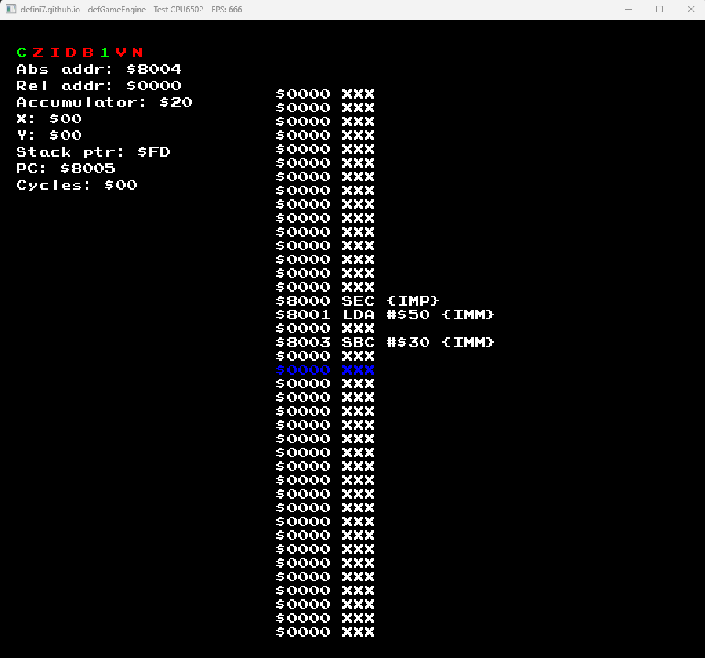

# 6502 CPU
Implementation of the 6502 CPU written purely in C++. 
The code tries to explain tricky parts of the implementation.

# Structure
There is a bus that has only 2 devices: CPU and RAM (8KB).
The emulation is almost complete: there are no NMI and IRQ yet
but since there is no interaction with the outer world the interrupts are redundant.

# Reference
There is an amazing [website](https://www.nesdev.org/wiki/) that explains every part of the 6502 emulating process, some of the links are directly inserted into the code.

# P. S.
The number of FPS on the screenshot accurately explains the development process of emulators
